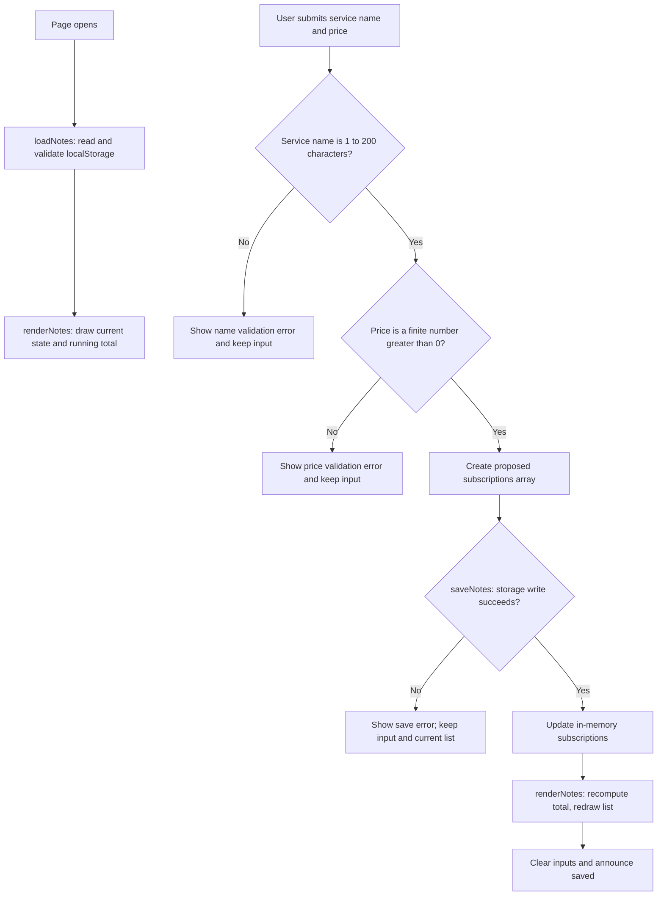

# Cost Tracker

## What

This is a subscription cost dashboard, adapted from the meeting-notes starter to implement F-01 from FEATURES.md: a place to track streaming subscriptions and see total monthly spend at a glance. See PROJECT.md for the full problem framing and FEATURES.md for the complete specification this feature is drawn from.

## See It Work

This demonstrates the Event-driven acceptance criterion: "When a user adds a new subscription entry with a price, the system shall update the total monthly spend shown on the dashboard within 2 seconds." The total ($48.00) correctly reflects the sum of all three entries ($20 + $13 + $15).

## How to Run

Create your repository from the this HW3 template and name it `mgt3745-hw3`. The supplied app is a starter; adapt it to one feature from your own specification.
This project runs inside a GitHub Codespace. No local install.

1. On your repository page, click **Code → Codespaces → Create codespace on main**. Wait for setup to finish; first-boot time varies.
2. Keep the supplied `.devcontainer/devcontainer.json`. It configures Live Server installation and port 5500 forwarding. Once the extension is ready, right-click `index.html` and choose **Open with Live Server**, or use **Go Live**.
3. If a browser tab does not open, use the **Ports** tab to open port 5500. Keep its visibility **Private**.
4. With Live Server running, save your edits to reload the page.

If Live Server is unavailable, run `node scripts/serve.mjs` in the terminal, then open port 5500 from the Ports tab. Refresh the browser after edits when using this fallback; stop it with **Ctrl+C**. Run only one server on port 5500 at a time. The fallback also works locally with Node 22 or later. Serve over HTTP rather than opening `index.html` through `file://`.

## How It Works

In `app.js`, `loadNotes` reads stored data and validates that each entry has a non-empty `service` string and a finite, positive `price`, discarding and warning on anything else. `saveNotes` attempts to persist a proposed array of `{ service, price }` objects — its logic is unchanged from the starter; it still just writes whatever array it's given and reports success or failure. `renderNotes` draws the current list using `textContent` for user-entered text, and additionally computes the running total (`notes.reduce((sum, entry) => sum + entry.price, 0)`) and displays it above the list. The submit handler validates both fields — a non-empty service name and a price greater than 0 — and only updates the visible state after a successful save. Delete also saves the proposed state before redrawing, and the total recalculates automatically since it's derived fresh on every render. A read failure shows a warning and starts with an empty in-memory list; it leaves the original storage unchanged until a successful new save replaces it.

## Status

| Area | State | Why |
|------|-------|-----|
| Save and display | Works | [Screenshot](docs/subscription-dashboard.png) shows three saved subscriptions with prices and a total of $48.00, matching manual addition.|
| Invalid input | Works |[Verification results](context/FEATURES.md#verification)empty service name and $0/negative price each produced distinct error messages. |
| Data survives reload / storage failure | Works | [Verification results](context/FEATURES.md#verification) reload preserved entries and total; ?failSave triggered the correct save-failure message. |
| Multi-user sync (starter limitation) | Deferred | Browser-local storage does not provide sync. Explain your own scope and decision in [ADR-001](context/ARCHITECTURE.md). |

Verification results (click to expand)

Full verification record: [context/FEATURES.md#verification](context/FEATURES.md#verification). Scope note: only F-01/F-05 (subscription entry and cost dashboard) were built this cycle per ADR-001; statements tied to unselected features (F-02, F-03, F-06) are marked CANNOT TEST YET rather than PASS or FAIL.

| Criterion / EARS statement | Steps and input | Expected result | Observed result | Status | Evidence / commit |
|---|---|---|---|---|---|
| Event-driven: adding a subscription updates total spend within 2 seconds | Added three subscriptions: netflix $20, hulu $13, spotify $15 | Total shows $48.00 immediately after each add | Total updated instantly and correctly after each entry | PASS | [Screenshot](docs/subscription-dashboard.png) |
| Unwanted (implementation-level, not yet a numbered EARS statement): invalid input is rejected with a clear message | Submitted an empty service name; separately submitted a $0 and a negative price | Distinct error message per case, entry not saved | Correct distinct error message shown in each case; no invalid entry was saved | PASS | Manually tested in Codespace; not yet formalized as a numbered Acceptance statement — see note below |
| Unwanted/State-driven (implementation-level): data persists on reload and a save failure is handled | Reloaded the page after saving three entries; separately loaded the page with `?failSave` in the URL and attempted to save | Entries and total persist after reload; `?failSave` shows a save error and keeps the entry in the input | Entries and total persisted correctly after reload; `?failSave` showed the correct error and preserved the input | PASS | Manually tested in Codespace; not yet formalized as a numbered Acceptance statement — see note below |
| Ubiquitous: no pirated content sources referenced in Safe pick / Something new flows | N/A — flow not built this cycle | N/A | Flow does not exist in current build | CANNOT TEST YET | F-02/F-03 out of scope for HW3 per ADR-001 |
| State-driven: "What should I watch?" disabled with zero entries | N/A — flow not built this cycle | N/A | No such button exists in current build | CANNOT TEST YET | F-02/F-03 out of scope for HW3 per ADR-001 |
| Unwanted: zero filter matches show a no-matches message | N/A — flow not built this cycle | N/A | Mood/format filter does not exist in current build | CANNOT TEST YET | F-03 out of scope for HW3 per ADR-001 |
| Optional: renewal date displayed alongside service when given | Checked `index.html`/`app.js` for a renewal date field | Renewal date input and display present | No renewal date field exists anywhere in the current build | FAIL | Confirmed by code review; genuine gap between FEATURES.md Behavior step 1 and shipped code |

## Links

Read in this order:

0. [`SCAFFOLD_MANIFEST.md`](SCAFFOLD_MANIFEST.md): explains what carries over from HW2 into HW3, along with a submission checklist
1. [`context/PROJECT.md`](context/PROJECT.md): the problem and its framing
2. [`context/USERS.md`](context/USERS.md): who this is for
3. [`context/FEATURES.md`](context/FEATURES.md): what it must do, and verification results
4. [`context/ARCHITECTURE.md`](context/ARCHITECTURE.md): the gate and ADR-001
5. [`context/STANDARDS.md`](context/STANDARDS.md): the rules this code follows
6. [`context/CLAUDE.md`](context/CLAUDE.md): the same rules, for agents

The scaffold has **eleven canonical files in `/context`: six active files above and five previews**: [STYLE.md](context/STYLE.md), [TOOLS.md](context/TOOLS.md), [SKILLS.md](context/SKILLS.md),

## AI Use

I asked claude to help me understand the steps I should take and along the way I asked it to check my code for errors and to make sure it was easy to understand/read.
I didn't read ahead and figure out that I needed a classmate to complete Standards.md with me so I asked claude to write a mock answer which helped me edit a mistake I made, but I understand that is not ideal for the assignment and if possible I'd love to contact a classmate maybe during the next lecture so that I can do that section correctly.
**Tool and task delegated: Claude chat interface helped me thorugh STANDARDS.md/CLAUDE.md's five rules and Split Test reasoning, and a simulated Colleague Test read of CLAUDE.md.

**Why: There is a ton of content to get through and I needed it to help me stay focused on what was important for each tasks as quickly/efficiently as possible.

**How it was checked: I tried not to let it do any heavy lifting it was more of an editor thus I was just taking it criticism into account rather than using it and then editing what it gave me.

**Observed result / evidence: I have nothing to show for this.

If no AI assistance was used, say so and describe your independent check. Full Delegation Decision Records begin at HW5; this lightweight record is sufficient here.

**Instruction discovery and compliance: I didn't use a live tool I used claudes chat so that I could show it exactly what I needed help with and nothing more. It also helped me stay organized because I can use the split view to see my "next steps" whenever I asked claude to help me outline steps for a section.

**Actual hours on this assignment (optional):** 6-7

## Explain, Change, Verify

Function: renderNotes
Input: the in-memory notes array — now objects shaped { service, price } instead of plain strings.
State changes: none — renderNotes is a pure read/render function; it doesn't mutate notes or write to storage.
Output: rebuilds the <ul> list (one <li> per subscription, showing Service — $price/mo with a delete button) and writes a computed total (notes.reduce((sum, entry) => sum + entry.price, 0)) into #spend-total.

Before: rendered each note as plain text with no aggregate figure.
After: renders service name and formatted price per entry, and displays a running total above the list, recalculated on every render.
Expected effect: a user should see their total monthly spend update immediately whenever they add or delete a subscription, without a page reload.
Observed behavior: confirmed directly — adding a subscription updated the total instantly, and deleting one recalculated it correctly, matching the F-01 acceptance criterion.
Why this matters: F-01 was classified Must-be in FEATURES.md because both interview participants underestimated their own subscription count when asked directly. This function is the one place in the app where that hidden gap becomes visible to the user — everything else (data entry, validation, storage) exists to make this calculation possible and reliable.

