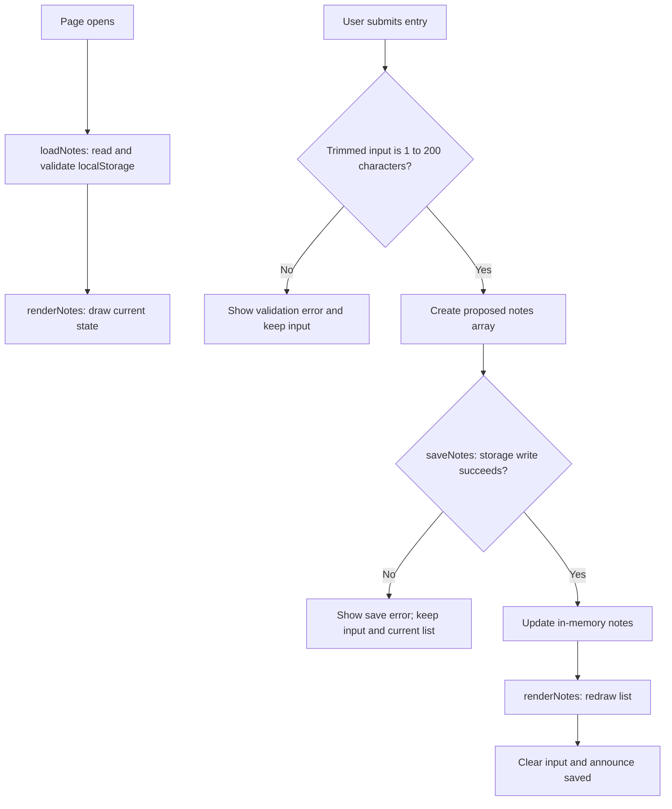

# Cost Tracker

> HW3, MGT 3745 O. Replace every [bracketed prompt] with your own writing.
> Lines between `<!--` and `-->` are notes to you. They are invisible on GitHub. Delete them when done.
> This README is the first thing an employer, a teammate, or an agent reads. It makes
> a case for the repository. Show, then tell.

## What

This is a subscription cost dashboard, adapted from the meeting-notes starter to implement F-01 from FEATURES.md: a place to track streaming subscriptions and see total monthly spend at a glance. See PROJECT.md for the full problem framing and FEATURES.md for the complete specification this feature is drawn from.

## See It Work

Put a screenshot or GIF under docs/ and link it here with descriptive alt text. Explain which acceptance criterion it demonstrates.

This demonstrates the Event-driven acceptance criterion: "When a user adds a new subscription entry with a price, the system shall update the total monthly spend shown on the dashboard within 2 seconds." The total ($48.00) correctly reflects the sum of all three entries ($20 + $13 + $15).

## How to Run

Create your repository from the this HW3 template and name it `mgt3745-hw3`. The supplied app is a starter; adapt it to one feature from your own specification.
This project runs inside a GitHub Codespace. No local install.

1. On your repository page, click **Code → Codespaces → Create codespace on main**. Wait for setup to finish; first-boot time varies.
2. Keep the supplied `.devcontainer/devcontainer.json`. It configures Live Server installation and port 5500 forwarding. Once the extension is ready, right-click `index.html` and choose **Open with Live Server**, or use **Go Live**.
3. If a browser tab does not open, use the **Ports** tab to open port 5500. Keep its visibility **Private**.
4. With Live Server running, save your edits to reload the page.

If Live Server is unavailable, run `node scripts/serve.mjs` in the terminal, then open port 5500 from the Ports tab. Refresh the browser after edits when using this fallback; stop it with **Ctrl+C**. Run only one server on port 5500 at a time. The fallback also works locally with Node 22 or later. Serve over HTTP rather than opening `index.html` through `file://`.

## How It Works

This diagram describes the starter's load-and-add flow. Update it to match your implementation. In `app.js`, `loadNotes` reads stored data, `saveNotes` attempts to persist a proposed state, and `renderNotes` draws the current state using `textContent` for user text. The submit handler validates input and updates the visible state only after a successful save. Delete also saves the proposed state before redrawing. A read failure shows a warning and starts with an empty in-memory list; it leaves the original storage unchanged until a successful new save replaces it.

## Status

| Area | State | Why |
|------|-------|-----|
| Save and display | Works | [Screenshot](docs/subscription-dashboard.png) shows three saved subscriptions with prices and a total of $48.00, matching manual addition.|
| Invalid input | Works | Verification results — empty service name and $0/negative price each produced distinct error messages. |
| Data survives reload / storage failure | Works | Verification results — reload preserved entries and total; ?failSave triggered the correct save-failure message. |
| Multi-user sync (starter limitation) | Deferred | Browser-local storage does not provide sync. Explain your own scope and decision in [ADR-001](context/ARCHITECTURE.md). |

Verification results (click to expand)

Keep the full verification record in [FEATURES.md](context/FEATURES.md). Summarize it here or link directly to its Verification section; keep both consistent.

| Criterion / EARS statement | Steps and input | Expected result | Observed result | Status | Evidence / commit |
|---|---|---|---|---|---|
| [Your selected criterion ID] | [Reproducible procedure] | [State before testing] | [What actually happened] | [PASS / FAIL / CANNOT TEST / DEFERRED] | [Link] |

Cover a normal action, relevant invalid input, and persistence or failure. PASS requires observed results that match expectations; all-PASS is acceptable with evidence. For CANNOT TEST, state the limitation and next step. Identify unselected requirements separately; DEFERRED does not waive the required HW3 feature. A screenshot alone cannot establish reload or storage-failure behavior.

## Links

Read in this order:

0. [`SCAFFOLD_MANIFEST.md`](SCAFFOLD_MANIFEST.md): explains what carries over from HW2 into HW3, along with a submission checklist
1. [`context/PROJECT.md`](context/PROJECT.md): the problem and its framing
2. [`context/USERS.md`](context/USERS.md): who this is for
3. [`context/FEATURES.md`](context/FEATURES.md): what it must do, and verification results
4. [`context/ARCHITECTURE.md`](context/ARCHITECTURE.md): the gate and ADR-001
5. [`context/STANDARDS.md`](context/STANDARDS.md): the rules this code follows
6. [`context/CLAUDE.md`](context/CLAUDE.md): the same rules, for agents

The scaffold has **eleven canonical files in `/context`: six active files above and five previews**: [STYLE.md](context/STYLE.md), [TOOLS.md](context/TOOLS.md), [SKILLS.md](context/SKILLS.md), [EVALS.md](context/EVALS.md), and [AGENTS.md](context/AGENTS.md). Keep the previews; verification stays in FEATURES.md until EVALS.md activates in Module 5.

Root README.md and the two instruction adapters—[CLAUDE.md](CLAUDE.md) and [.github/copilot-instructions.md](.github/copilot-instructions.md)—are additional files. Copy your HW2 USERS.md and FEATURES.md into `/context` and revise them using instructor feedback if available; otherwise record a peer criterion check and mark instructor feedback pending. Run `node scripts/check-scaffold.mjs` to check required file presence; this does not assess content quality.

## AI Use

minimal I asked claude to help me understand the steps I should take and along the way I asked it to check my code for errors and to make sure it was easy to understand/read.

**Tool and task delegated:** [Which parts a tool drafted: e.g. "Copilot drafted render() and the CSS."]

**Why:** [The reason it made sense to delegate that part rather than write it.]

**How it was checked:** [What you inspected, what you changed, what you caught. "Replaced innerHTML with textContent" is the kind of sentence that belongs here.]

**Observed result / evidence:** [What the checks actually showed; link the relevant verification row, code change, or other evidence. Do not invent a run.]

If no AI assistance was used, say so and describe your independent check. Full Delegation Decision Records begin at HW5; this lightweight record is sufficient here.

**Instruction discovery and compliance:** [Record the tool and mode, which instruction adapter it discovered, and the reference or diagnostic evidence. Separately report whether one generated change followed the applicable standards. If no live AI tool is available, write “not run” and record a manual standards review.]

**Actual hours on this assignment (optional):** 4

## Explain, Change, Verify

Function: renderNotes
Input: the in-memory notes array — now objects shaped { service, price } instead of plain strings.
State changes: none — renderNotes is a pure read/render function; it doesn't mutate notes or write to storage.
Output: rebuilds the <ul> list (one <li> per subscription, showing Service — $price/mo with a delete button) and writes a computed total (notes.reduce((sum, entry) => sum + entry.price, 0)) into #spend-total.

Before: rendered each note as plain text with no aggregate figure.
After: renders service name and formatted price per entry, and displays a running total above the list, recalculated on every render.
Expected effect: a user should see their total monthly spend update immediately whenever they add or delete a subscription, without a page reload.
Observed behavior: confirmed directly — adding a subscription updated the total instantly, and deleting one recalculated it correctly, matching the F-01 acceptance criterion.
Why this matters: F-01 was classified Must-be in FEATURES.md because both interview participants underestimated their own subscription count when asked directly. This function is the one place in the app where that hidden gap becomes visible to the user — everything else (data entry, validation, storage) exists to make this calculation possible and reliable.

